# Project Name
Gwendoline Thornton

## Table of Contents
1. Introduction
2. Project Overview
3. User Experience (UX)
4. Wireframes
5. Features
6. Technologies Used
7. Testing
8. Deployment
9. Credits
10. Acknowledgements

## 1. Introduction
- **What the project is:** Portfolio
- **Objectives:** I want it to be clear who Gwendoline Thornton is, what I do and how people visiting the site can get in touch.
- **3 Pages:** Home Page (Key Projects & Services/Skills for sale), About Page (CV History) & Contact Page
- **Audience:** Customers, Employers, Collaborators
- **SEO:** Keywords such as "Gwendoline Thornton" need to be in the title & H1 tags, and possibly lower down in H2 tags. For an image of Gwen there should be an alt tag with my name "Gwendoline Thornton"
- **Image Optimization:** Optimize images so they have small file sizes 

## 2. Project Overview
A three-page personal portfolio website for Gwendoline Thornton, owner of THE.WORKSHOP LTD, a product design and manufacturing company working across hardware, assistive tech and plastic toy manufacturing. The website is to be a professional location and home for all of my work that can be shown to employers, collaborators and potential clients when they search my name, rather than relying solely on LinkedIn or third-party press coverage.
- **Home Page:** Name, short biography, headline projects/work
- **About Page:** CV History, Prior Experience, Skills
- **Contact Page:** Contact Details

The page will be made from HTML and CSS only.

## 3. User Experience (UX)
### Project Goals
- Give Gwendoline Thornton a single, self-owned, professional web presence ranking for her name.
- Communicate clearly who I am and what I do for several different audiences.
- Make it easy visitors to contact her
- Use HTML & CSS in the code

## User Stories
### Employer or Collaborator
As an employer, I want to find a relevant skilled worker with evidence of previous work experience so that I can employ them to work on relevant manufacturing problems within the business.
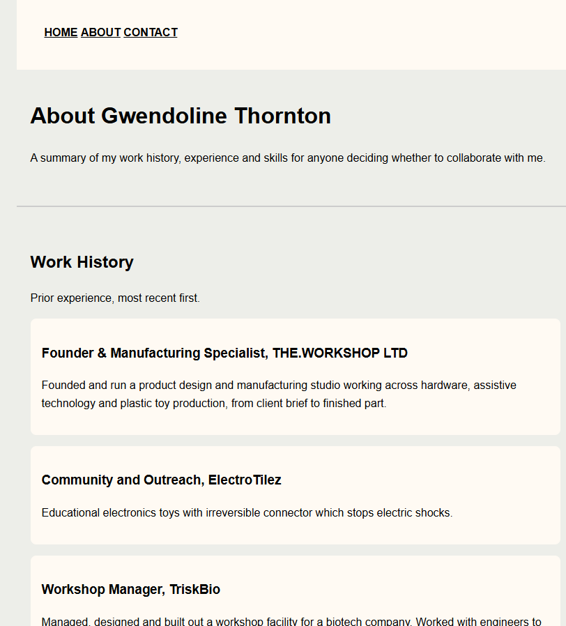
The screenshot shows that the work history on the about page fulfils the employer's requirements. 

As a collaborator, I want to find people with significant experience in compatible skills sets, such as Computer Aided Design, so that I can work with them to create a great product or experience for clients.
- Skills and experience and assess my fit for a role/project.
- A CV-style summary of work history in one place
- Easy to contact me (Gwen) directly
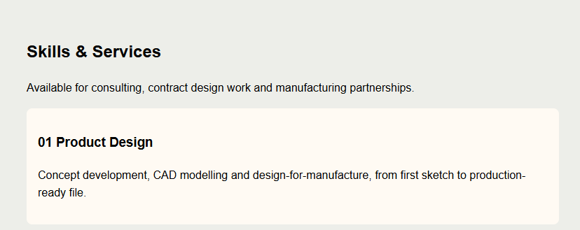
The screenshot shows the skills and services that could match with a collaborator's needs, such as computer aided design. 

### Customer
As a customer, I want to find relevant qualified services so that I can manufacture or design a particular product.
- Who Gwen is, her skills and services on offer and can decide to reach out
- Evidence of past work or projects which build trust
- Contact details easily accessible
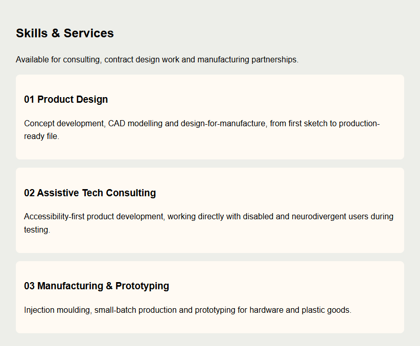
The screenshot shows that the skills and services section matches with the customer's needs to quickly qualify someone and if they have the right skill set.

### Design Choices
- Minimal, clean, content-first layout which puts text and key information first, with minimal decoration
- Significant white space and clear text hierarchy so the page can be easily scanned and read easily by recruiters/clients
- Consistent Layout/Navigation on all of the pages 

### Color Scheme
- Background Color: Hex Code #EDEEE9
- Text Color: Hex Code #000000
- Typography: Body Text: Sans-serif

### Information Architecture
- Home Page: Name, Summary/Introduction, Highlighted Work
- About Page: CV History Content, experience, skills and awards
- Contact Page: Email, Phone Number, LinkedIn, Relevant Company Pages
- Consistent header and footer across all pages for consistency 

## 4. Wireframes
- Home Page Wireframe 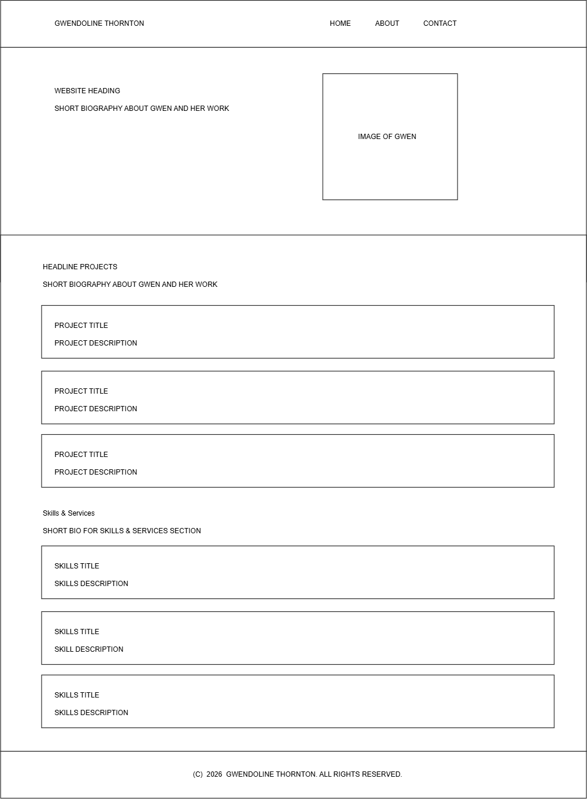

- About Page Wireframe 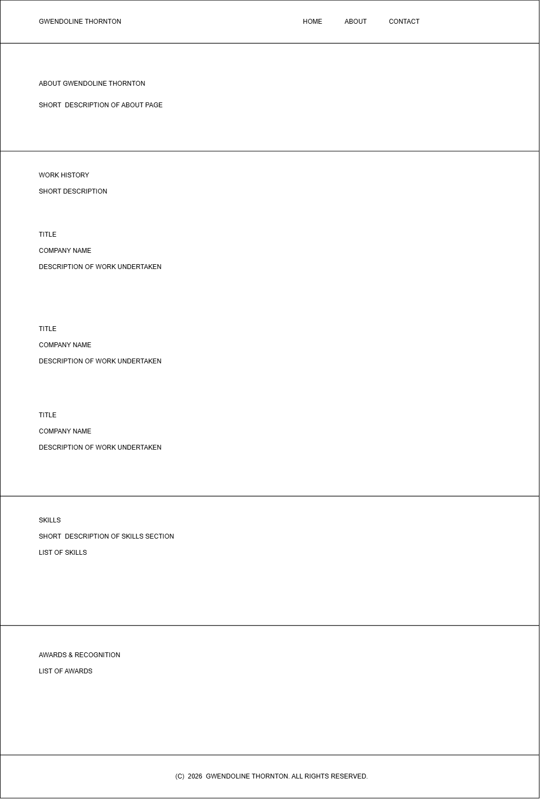

- Contact Page Wireframe 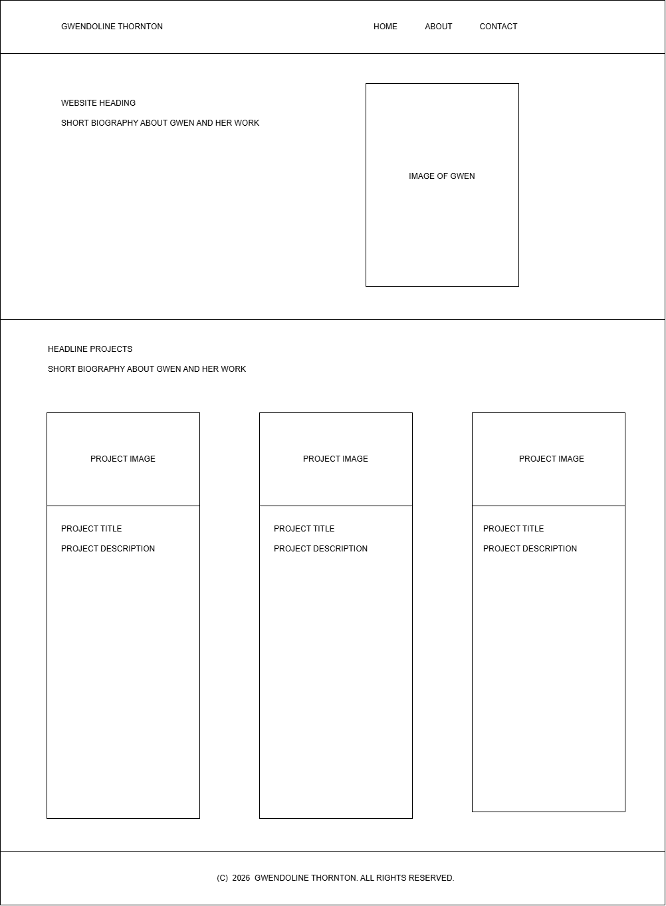

## 5. Features
### Existing Features
- Home Page
- About Page
- Contact Page

### Future Features
- Blog section
- Testimonial from clients
- Working Contact Form with email integration

## 6. Technologies Used
- HTML5 
- CSS
- Visual Studio Code
- GitHub
- W3C Validator
- Jigsaw Validator

## 7. Testing
### Manual Testing
1. Clicking through navigation links and page content across all pages.
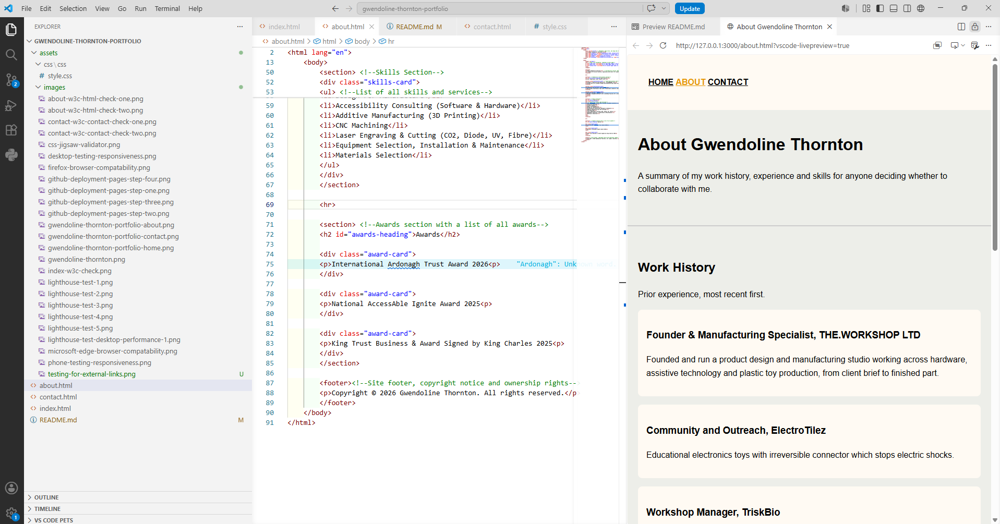
2. Clicking on all links that lead externally from the page to ensure that they open up into a new page
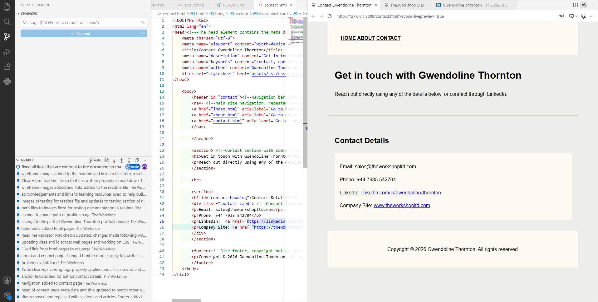
3. The page was opened up both in visual studio code and via GitHub pages, and the size of the viewing area of the page was adjusted by both width and height manually through both adjusting the size of the browser or the view. This showed how the page moved and that all sections remained stable when the viewing window changed.

### User Story Testing
|User Story | How it was met |
|---|---|
|Skills and experience to assess fit | About page lists work history, skills and award in a clear easy to read format
|Work history | Recent work history listed on the About Page
|How to Contact Gwendoline Thornton | Contact Page with several different options for the person to reach out on
|Understand who Gwendoline is and what she does | Home page with name, jon title and short summary of focus area
|Evidence of past work | Home page has "Headline Projects" section with 3 project cards and descriptions

### Validator Testing
Testing the index.html code through the W3C validator for errors. No errors found.

Testing the about.html code through the W3C validator for errors. There were several errors relating to using the section tag for the skills list and the awards section. So the section tag was changed to a div tag here.

Testing about.html code through the W3C validator second check. No errors found.

Testing contact.html code through the W3C validator first check. There is a section with no heading that will be changed to a div.

Testing contact.html code through the W3C validator second check. No errors found.

Testing custom css code through Jigsaw validator. No errors found.

### Lighthouse Testing
Testing the github page in Google Chrome Lighthouse for performance issues for both mobile and desktop
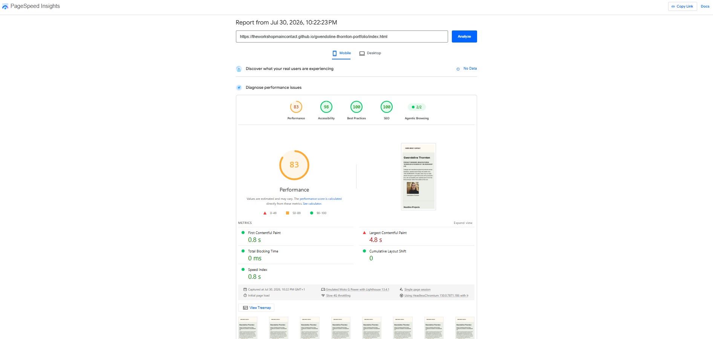

### Lighthouse Desktop performance test

### Browser Compatibility
Tested website in Google Chrome
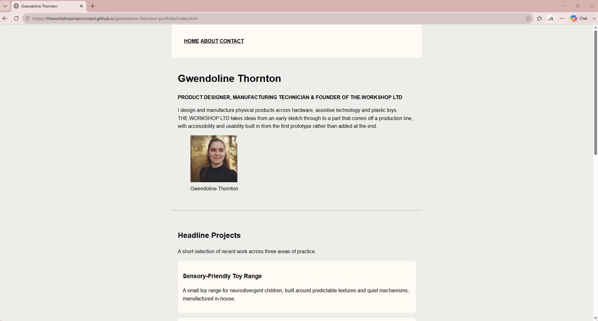

Tested website in Firefox
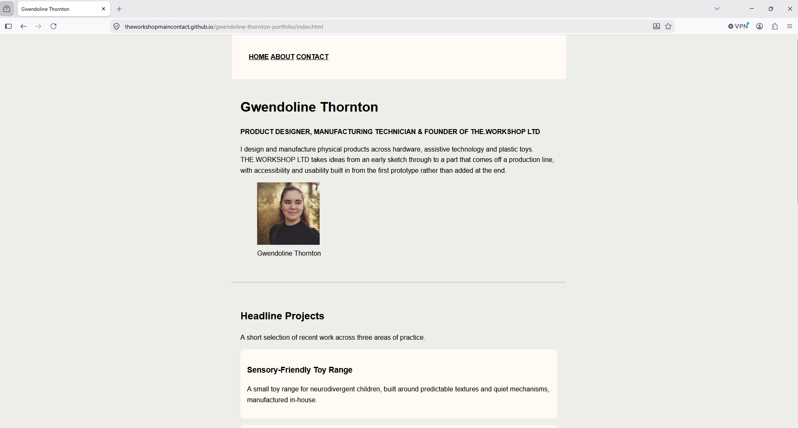

I was not able to test on Safari via the windows laptop/desktop that I had to try the github page.

### Responsiveness Testing
Testing on a mobile and a laptop view through using the inspect view

### Bugs Fixed
1. The article tag was switched to the section tag upon review that it wasn't the appropriate tag. These were changes to sections.
2. The style.css sheet was not linked properly to the html documents due to an incorrect path.
3. The path for all of the images referenced in both the home page (index.html) and README.md was not working when the project was pushed to GitHub pages, this had to be changed when the site was published by removing the "/" at the start of the path.

### Known Issues
The portfolio image is is underneath the summary paragraph of the home page, I would like to move the placement of this image to the right side on a future version for personal aesthetic reasons that I think are easier to read and view from a customer/client viewing the website.

## 8. Deployment
This project is deployed using GitHub Pages.
The live site is hosted at: <https://theworkshopmaincontac.github.io/gwendoline-thornton-portfolio/about.html>

1. Go to github.com and log in or create an account.
2. Click the + icon in the top-right corner of the page and select New Repository
3. Name the New Repository
4. Select public so the site can be viewed, leave all other repository options on the default settings, then click Create Repository. 
5. GitHub will show an empty repository with setup instructions
6. To connect the project files (in visual studio code) already on your computer to the repository created on GitHub
7. Open the project folder in Visual Studio Code
8. Open a terminal in Visual Studio Code. Click Terminal in the top menu bar on the left, then New Terminal. This should open at the top of the Visual Studio Code so you can type the commands below.
9. To turn the folder into a Git project type `git init`
10. To link the folder to the repository created on GitHub type the following `git remote add origin https://github.com/TheWorkshopMainContact/gwendoline-thornton-portfolio.git`
11. To upload project files for the first time type `git add .`
12. To save them type `git commit -m "Initial commit"`
13. To make sure that the main branch is `main` by typing: `git branch -M main`
14. Push / Upload the files to GitHub for the first time: `git push -u origin main`

### Deploy a GitHub Page from the Repository
This section tells GitHub how to turn the files in the repository into a public website.

1. Click Settings on the repository's page on GitHub (top menu of the repository page)
2. On the left side-bar, click Pages
3. Under "Build and deployment" set the Source to deploy from as Deploy from a branch
4. For the "Branch" select main and/(root), then click Save.
5. GitHub displays a URL at the top of the page, this is the link to the public page

### Local Development Setup
Follow these steps to get a working copy of the project on a computer.

1. Install [Visual Studio Code](https://code.visualstudio.com/)
2. Install Git, download from [git-scm.com](https://git-scm.com/downloads). To check if it is already have installed, open a terminal (see step 6 in "Cloning the Repository" below for how) and type `git --version`, then press Enter. If a version number appears, it's already installed.
3. Clone the repository, see the **Cloning the Repository** section below for full step-by-step instructions.
4. Once cloned, open the project folder in VS Code: click **File** to **Open Folder**, then select the `gwendoline-thornton-portfolio` folder just cloned.
5. To view the site, find `index.html` in VS Code's file explorer on the left, right-click it, choose **Reveal in File Explorer**, then double-click the file to open it in the web browser.

### Cloning the Repository
1. Go to [github.com](https://github.com) and log in or create a free account
2. Go to the repository page: https://github.com/TheWorkshopMainContact/gwendoline-thornton-portfolio
3. Click the green button labelled **Code**.
4. A small box will drop down. Make sure the **HTTPS** tab is selected, then click the small copy icon next to the web address shown to copy it.
5. Open VS Code.
6. Open a terminal: click **Terminal** in the top menu bar, then **New Terminal**. A panel will open at the bottom of the window — this is where you'll type commands.
7. In the terminal, navigate to the folder on your computer where you want to save the project. Do this by typing `cd` followed by a space and the folder path, then pressing Enter. For example, to save it in your Documents folder: `cd Documents`
8. Clone the repository by typing the following and pressing Enter (this pastes the address copied in step 4):
`git clone https://github.com/TheWorkshopMainContact/gwendoline-thornton-portfolio.git`
9. This creates a new folder called 'gwendoline-thornton-portfolio' containing a full copy of the project. Move into that folder by typing:
`cd gwendoline-thornton-portfolio`
10. Open the folder in VS Code by typing: `code .`

## 9. Credits
### Code Sources
- HTML and CSS layout tutorials from Code Institute LMS - <https://lms.codeinstitute.net/>

### Media Sources
The portfolio image is a personal photograph that Gwendoline had taken for LinkedIn

### Content References
- Bio text descriptions, projects and awards from Gwendoline Thornton's LinkedIn - <https://linkedin.com/in/gwendoline-thornton>
- Facts for HTML and CSS layout from Code Institute LMS - <https://lms.codeinstitute.net/>
- The header section of code at the top of my webpages is inspired from the Code Institute LMS - <https://lms.codeinstitute.net/>
- The CSS layout and format is inspired by CSS the CSS module in the Code Institute LMS - <https://lms.codeinstitute.net/>

## Acknowledgements
1. Built using Visual Studio Code, GitHub and GitHub Pages
2. W3C Validator - <https://validator.w3.org/>
3. Jigsaw Validator - <https://jigsaw.w3.org/css-validator/>
4. Lighthouse - <https://developer.chrome.com/docs/lighthouse>
5. W3 Schools HTML Tutorial - <https://www.w3schools.com/html/>
6. W3 SChools HTML Accessibility - <https://www.w3schools.com/html/html_accessibility.asp>
7. W3 Schools CSS Tutorial -<https://www.w3schools.com/css/default.asp>
8. Wireframe - <https://app.diagrams.net/>

