# Project Name
Gwendoline Thornton

## Table of Contents

1. Introduction
What the project is: Portfolio
Objectives: I want it to be clear who Gwendoline Thornton is, what I do and how people visiting the site can get in touch.
3 Pages: Home Page (Key Projects & Services/Skills for sale), About Page (CV History) & Contact Page
Audience: Customers, Employers, Collaborators
SEO: Keywords such as "Gwendoline Thornton" need to be in the title & H1 tags, and possibly lower down in H2 tags. For an image of Gwen there should be an alt tag with my name "Gwendoline Thornton"
Image Optimisation: Optimise images so they have small file sizes 

2. Project Overview
A three-page personal portfolio website for Gwendoline Thornton, owner of THE.WORKSHOP LTD, a product design and manufacturing company working across hardware, assistive tech and plastic toy manufacturing. The website is to be a professional location and home for all of my work that can be shown to employers, collaborators and potential clients when they search my name, rather than relying solely on LinkedIn or third-party press coverage.
Home Page: Name, short biography, headline projects/work
About Page: CV History, Prior Experience, Skills
Contact Page: Contact Details

The page will be made from HTML and CSS only.

3. User Experience (UX)
Project Goals
Give Gwendoline Thornton a single, self-owned, professional web presence ranking for her name.
Communicate clearly who I am and what I do for several different audiences.
Make it easy visitors to contact her
Use HTML & CSS in the code

User Stories
Employer or Collaborator
Skills and experience and assess my fit for a role/project.
A CV-style summary of work history in one place
Easy to contact me (Gwen) directly

Customer
Who Gwen is, her skills and services on offer and can decide to reach out
Evidence of past work or projects which build trust
Contact details easily accessible

Design Choices
Minimal, clean, content-first layout which puts text and key information first, with minimal decoration
Significant white space and clear text hierarchy so the page can be easily scanned and read easily by recruiters/clients
Consistent Layout/Navigation on all of the pages 

Colour Scheme
Background Colour: Hex Code #
Text Colour: Hex Code #

Typography
Body Text: Sans-serif

Information Architecture
Home Page: Name, Summary/Introduction, Highlighted Work
About Page: CV History Content, experience, skills and awards
Contact Page: Email, Phone Number, LinkedIn, Relevant Company Pages
Consistent header and footer across all pages for consistency 

4. Wireframes

5. Features
Existing Features
Home Page
About Page
Contact Page

Future Features
Blog section
Testimonial from clients
Working Contact Form with email integration

6. Technologies Used
HTML5 
CSS
Visual Studio Code
GitHub
W3C Validator
Jigsaw Validator

7. Testing
Manual Testing
Clicking through navigation links and page content across all pages

User Story Testing

Validator Testing
Testing the index.html code through the W3C validator for errors. No errors found.
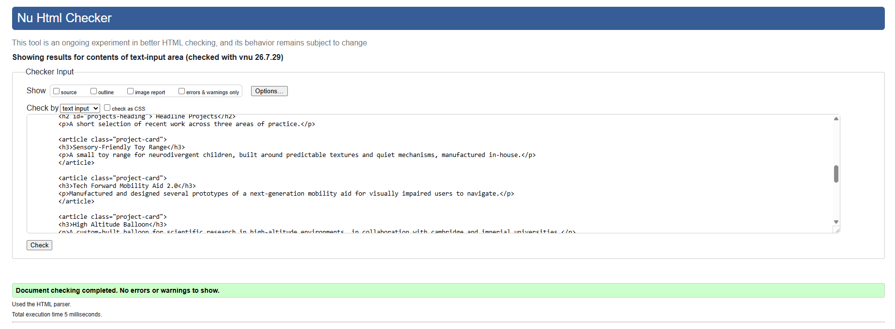

Testing the about.html code through the W3C validator for errors. There were several errors relating to using the section tag for the skills list and the awards section. So the section tag was changed to a div tag here.
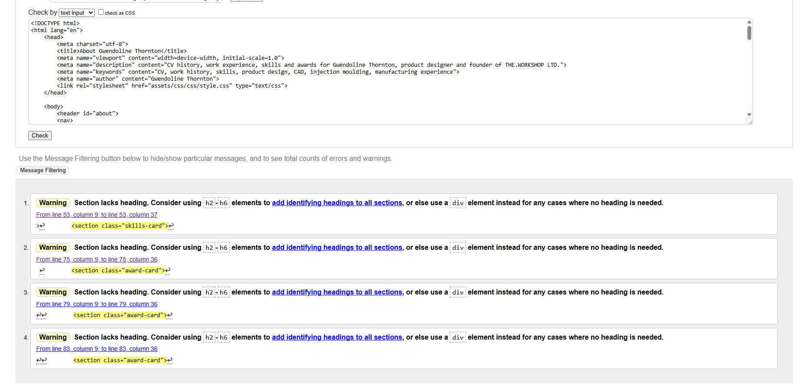

Testing about.html code through the W3C validator second check. No errors found.
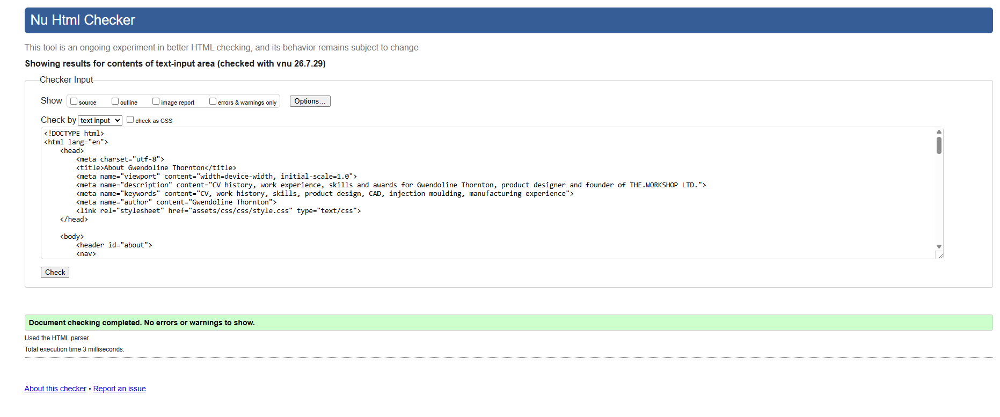

Testing contact.html code through the W3C validator first check. There is a section with no heading that will be changed to a div.

Testing contact.html code through the W3C validator second check. No errors found.

Testing custom css code through Jigsaw validator. No errors found.
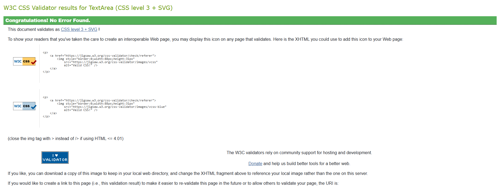

Lighthouse Testing
Testing the github page in Google Chrome Lighthouse for performance issues for both mobile and desktop

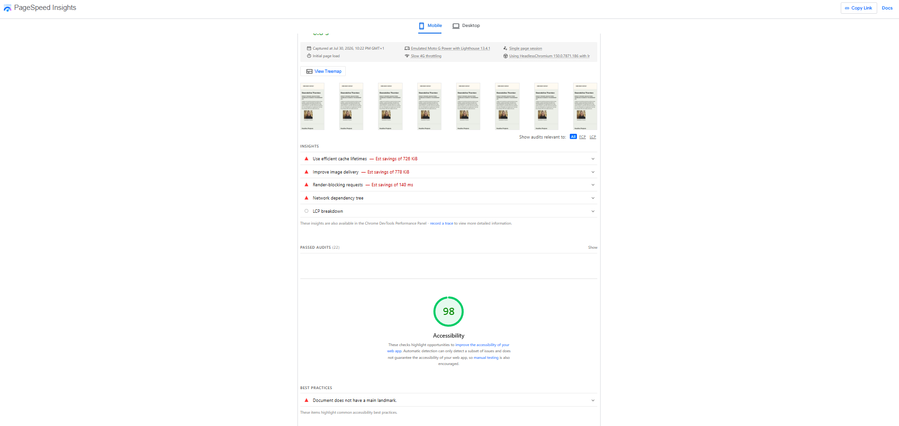
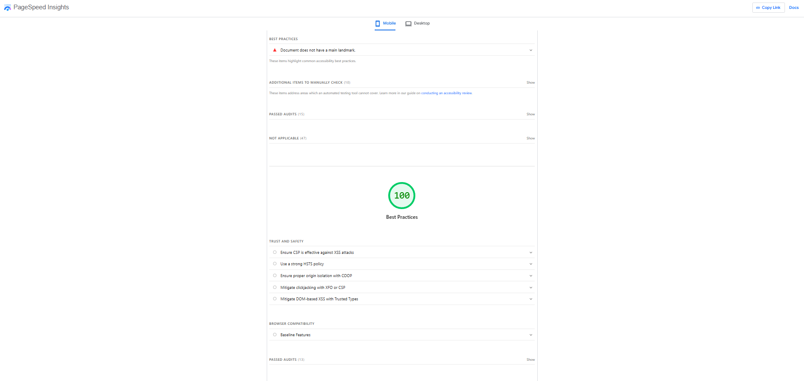
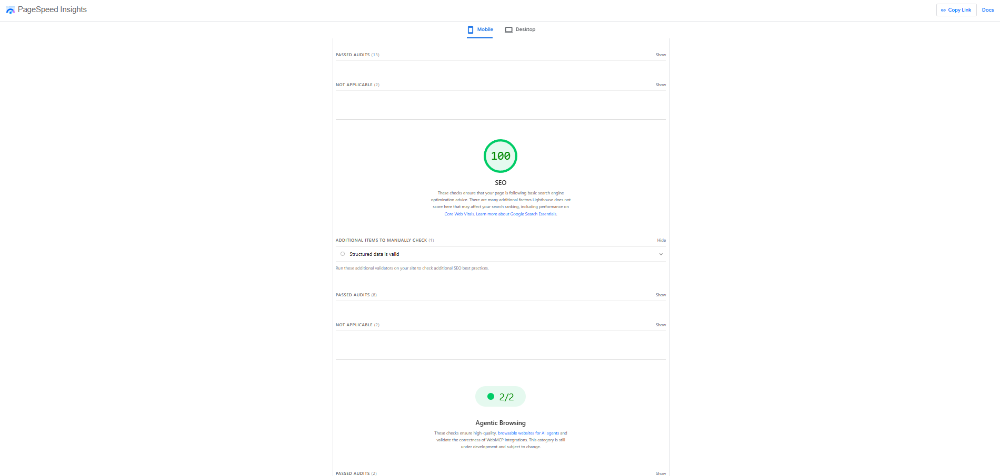
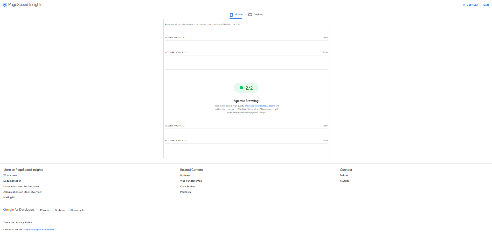

Lighthouse Desktop performance test
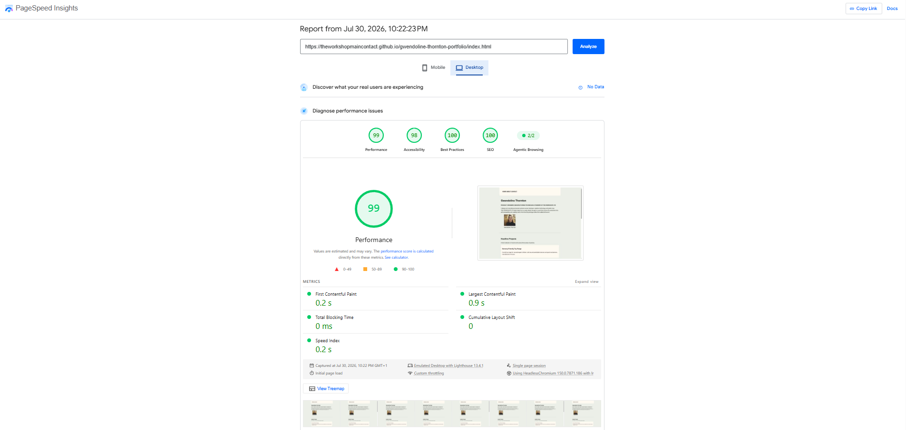

Browser Compatibility
Test in google chrome, Microsoft edge, Safari

Responsiveness Testing
Testing on a mobile and a laptop view through using the inspect view
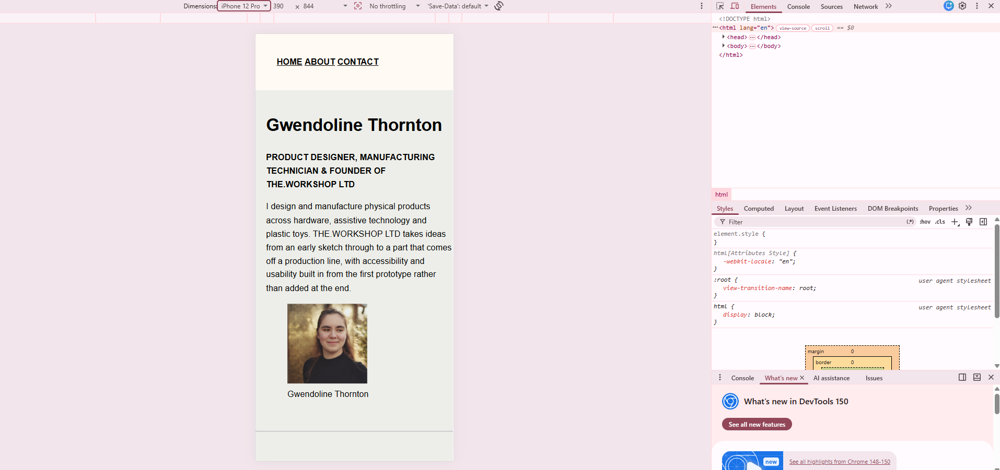
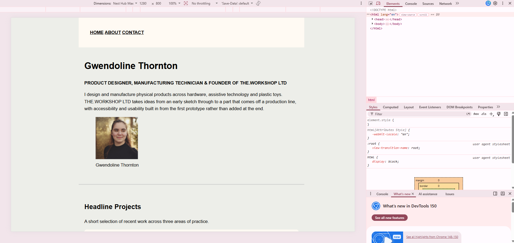

Bugs Fixed

##Known Issues
The portfolio image is is underneath the summary paragraph of the home page, I would like to move the placement of this image to the right side on a future version for personal aesthetic reasons that I think are easier to read and view from a customer/client viewing the website.

8. Deployment
##Deployment Steps
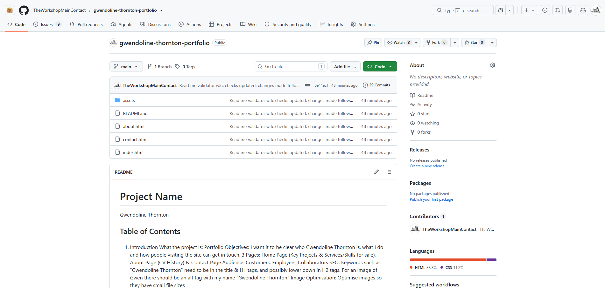
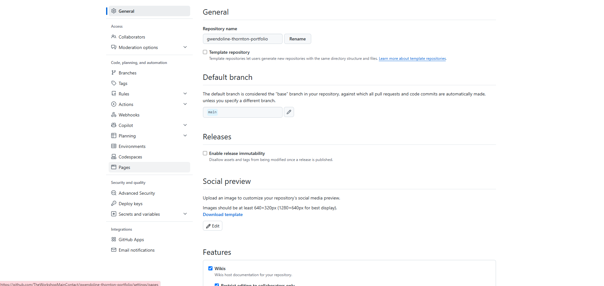
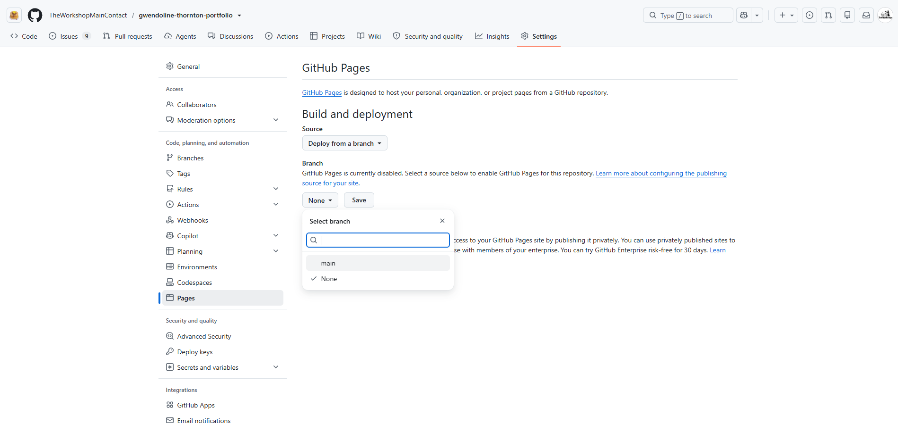
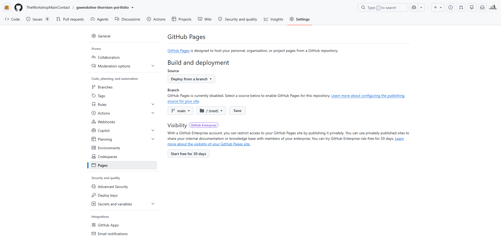

##Local Development Setup
1. Clone the repository
2. Move it into the folder
3. Open the project in VS Code
4. To view the site open the index.html in your browser  

##Cloning the Repository
1. Got to github.com
2. Click on the repository
3. Click on the button that says "Code"
4. A small box should drop down and
5. Copy the web address
6. Make a new folder labeled for the repository in your documents
7. Open VS Code
8. Open a new terminal in VS Code
9. Navigate through the terminal to where you want to save the project
10. Clone the repository
11. Open the folder that has the clone in VS code

9. Credits
    - Code Sources

##Media Sources
The portfolio image is a personal photograph that Gwendoline had taken for LinkedIn

##Content References

##Acknowledgements
1. Built using Visual Studio Code and GitHub Pages
2. W3C Validator - 
3. Jigsaw Validator - 
4. Lighthouse - 
5. W3 Schools HTML Tutorial - 
6. W3 SChools HTML Accessibility - 
7. W3 Schools CSS Tutorial - 

